<div align="center">

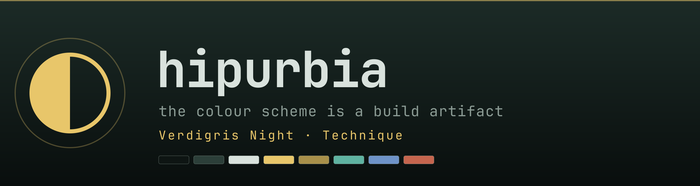

<em>An Arch Linux workstation you can rebuild from nothing —<br>
where the colour scheme is a build artifact, not a mood.</em>

<p>
  
  
  
  
  
</p>

</div>

<a href="#eight-palettes-one-source-of-colour">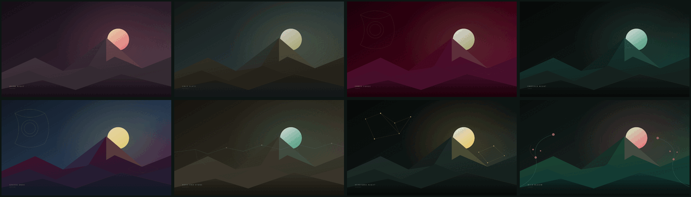</a>

<div align="center">

**os** Arch Linux · **wm** [Hyprland](https://hyprland.org) · **bar** Waybar · **term** kitty · **shell** bash<br>
**editor** Neovim / NvChad · **launchers** rofi · wofi · dmenu · **notify** dunst<br>
**lock** hyprlock + hypridle · **wallpaper** swaybg · **font** JetBrains Mono Nerd Font<br>
**greeter** ReGreet in a cage kiosk · **colour** `data/theme.conf` → `templates/` → `dotfiles/`

<br>

<sub>Two kinds of image on this page, and no third kind. The wallpapers and the banner are
<b>rendered</b> — <code>scripts/make-wallpaper.sh --all</code> and <code>scripts/make-logo.sh</code> turn
<code>data/themes/*.conf</code> into SVG and then into pixels, so the artwork is a build artifact like
everything else here. Every desktop below is a <b>real <code>grim</code> capture</b> taken inside the
QEMU/KVM guest that <code>scripts/test-vm.sh</code> builds from this tree — same commit, same deploy.
No mockups, no compositing, nothing hand-painted.</sub>

</div>

## Eight palettes, one source of colour

A theme here is not a pile of hand-edited stylesheets. `data/theme.conf` holds the palette;
everything that carries a colour lives in `templates/` and is *rendered* into `dotfiles/`;
`scripts/check-theme-drift.sh` fails the build when a committed render and its template
disagree. Switching palette (`Super+Shift+T`, the `◐` in the bar, or
`scripts/apply-theme.sh --theme NAME`) re-renders over the stowed symlinks live — wallpaper,
bar, borders, notifications, launcher and every open terminal — and choosing the default again
restores the symlinks byte for byte. Every colour must also exist in `data/palette-corpus.tsv`:
a colour with no cause is slop.

The terminal is part of that, not an exception to it: `templates/kitty/.config/kitty/kitty.conf.in`
carries `TERMINAL_FG` and `TERMINAL_BG` like every other themed file, and the terminals already
open re-read it on `SIGUSR1` — the signal kitty sends itself — so the palette lands in the window
you are looking at instead of the next one you open. Deploying does not undo any of this:
`deploy.sh` restows the committed defaults and then reapplies the theme named in
`~/.config/hipurbia/settings`, because restowing the default render over a live overlay used to
undress the desktop.

<table>
  <tr>
    <td width="50%" align="center"><sub><b>rendered</b> — <code>make-wallpaper.sh</code></sub></td>
    <td width="50%" align="center"><sub><b>captured</b> — <code>grim</code>, inside the VM</sub></td>
  </tr>
  <tr>
    <td width="50%" align="center">
      <a href="assets/wallpapers/warm-night.png"></a>
    </td>
    <td width="50%" align="center">
      <a href="assets/screenshots/warm-night.png">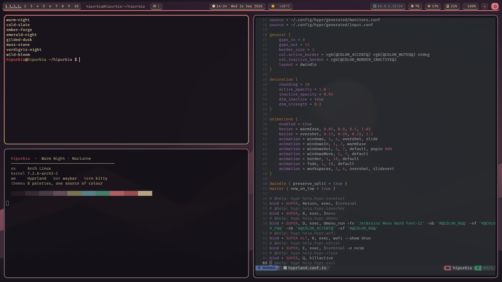</a>
    </td>
  </tr>
  <tr>
    <td colspan="2" align="center"><b>Warm Night</b> · <sub>Nocturne · <code>data/themes/warm-night.conf</code> · no ornament — the base composition on its own</sub></td>
  </tr>
  <tr>
    <td width="50%" align="center">
      <a href="assets/wallpapers/cold-slate.png"></a>
    </td>
    <td width="50%" align="center">
      <a href="assets/screenshots/cold-slate.png">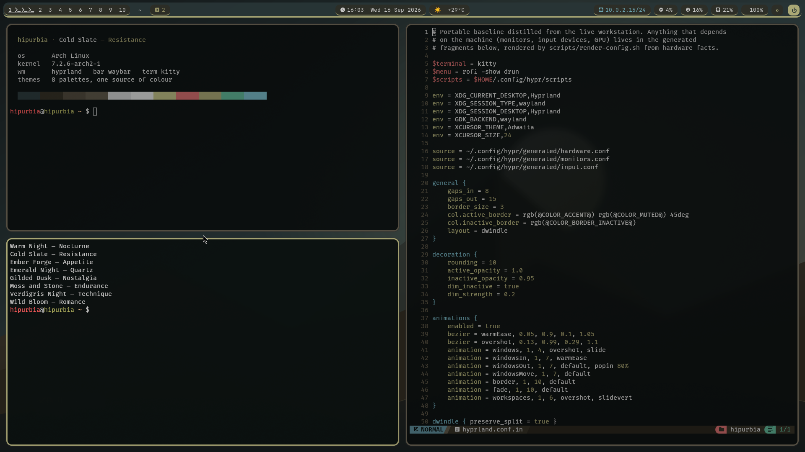</a>
    </td>
  </tr>
  <tr>
    <td colspan="2" align="center"><b>Cold Slate</b> · <sub>Resistance · <code>data/themes/cold-slate.conf</code> · no ornament</sub></td>
  </tr>
  <tr>
    <td width="50%" align="center">
      <a href="assets/wallpapers/ember-forge.png">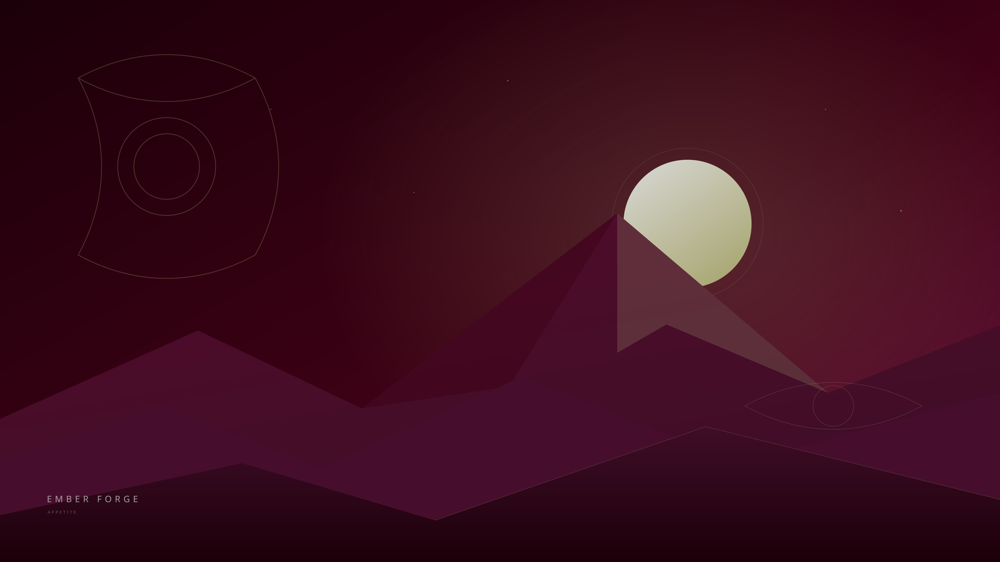</a>
    </td>
    <td width="50%" align="center">
      <a href="assets/screenshots/ember-forge.png">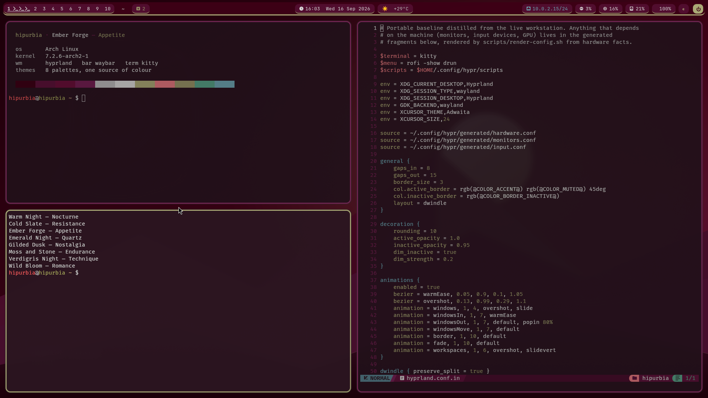</a>
    </td>
  </tr>
  <tr>
    <td colspan="2" align="center"><b>Ember Forge</b> · <sub>Appetite · <code>data/themes/ember-forge.conf</code> · filigree</sub></td>
  </tr>
  <tr>
    <td width="50%" align="center">
      <a href="assets/wallpapers/emerald-night.png">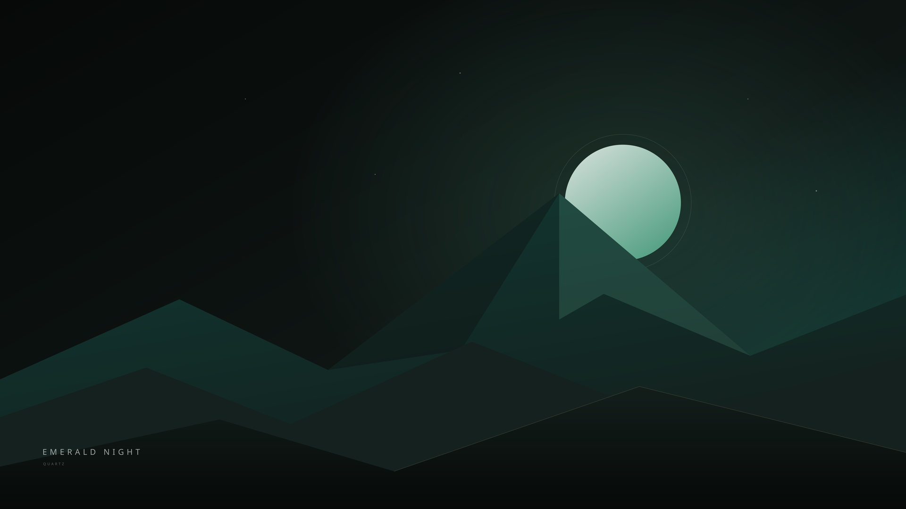</a>
    </td>
    <td width="50%" align="center">
      <a href="assets/screenshots/emerald-night.png"></a>
    </td>
  </tr>
  <tr>
    <td colspan="2" align="center"><b>Emerald Night</b> · <sub>Quartz · <code>data/themes/emerald-night.conf</code> · no ornament</sub></td>
  </tr>
  <tr>
    <td width="50%" align="center">
      <a href="assets/wallpapers/gilded-dusk.png"></a>
    </td>
    <td width="50%" align="center">
      <a href="assets/screenshots/gilded-dusk.png"></a>
    </td>
  </tr>
  <tr>
    <td colspan="2" align="center"><b>Gilded Dusk</b> · <sub>Nostalgia · <code>data/themes/gilded-dusk.conf</code> · filigree</sub></td>
  </tr>
  <tr>
    <td width="50%" align="center">
      <a href="assets/wallpapers/moss-stone.png">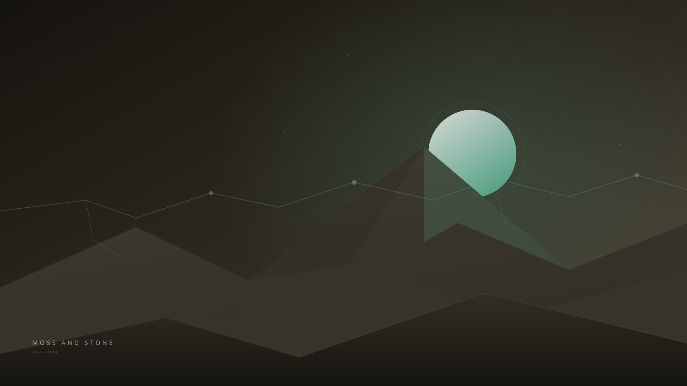</a>
    </td>
    <td width="50%" align="center">
      <a href="assets/screenshots/moss-stone.png">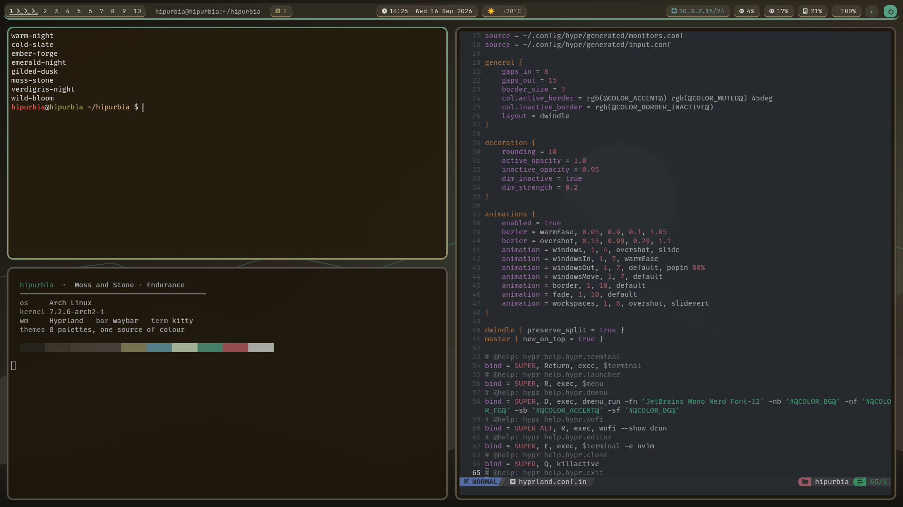</a>
    </td>
  </tr>
  <tr>
    <td colspan="2" align="center"><b>Moss and Stone</b> · <sub>Endurance · <code>data/themes/moss-stone.conf</code> · vein</sub></td>
  </tr>
  <tr>
    <td width="50%" align="center">
      <a href="assets/wallpapers/verdigris-night.png"></a>
    </td>
    <td width="50%" align="center">
      <a href="assets/screenshots/verdigris-night.png">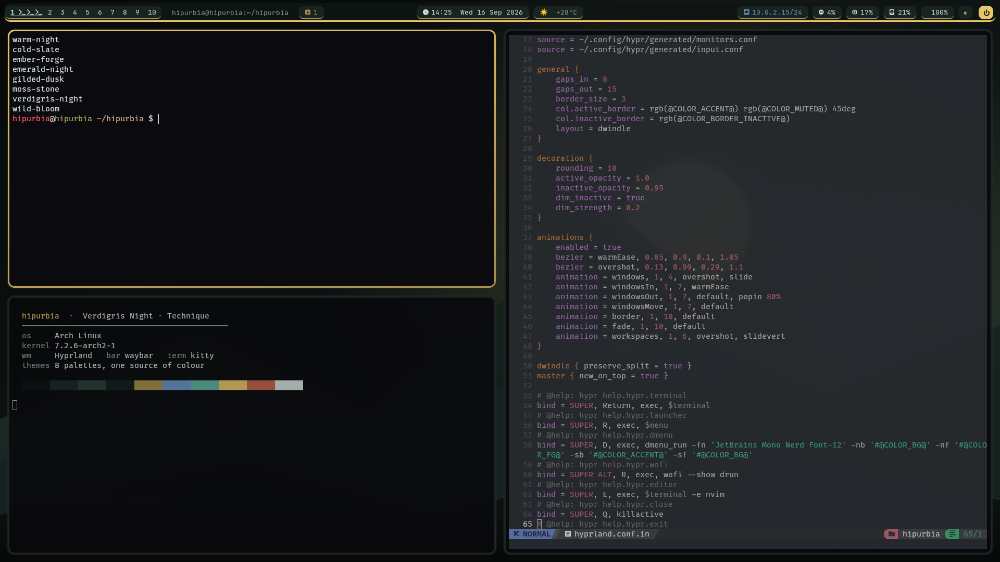</a>
    </td>
  </tr>
  <tr>
    <td colspan="2" align="center"><b>Verdigris Night</b> · <sub>Technique · <code>data/themes/verdigris-night.conf</code> · constellation</sub></td>
  </tr>
  <tr>
    <td width="50%" align="center">
      <a href="assets/wallpapers/wild-bloom.png">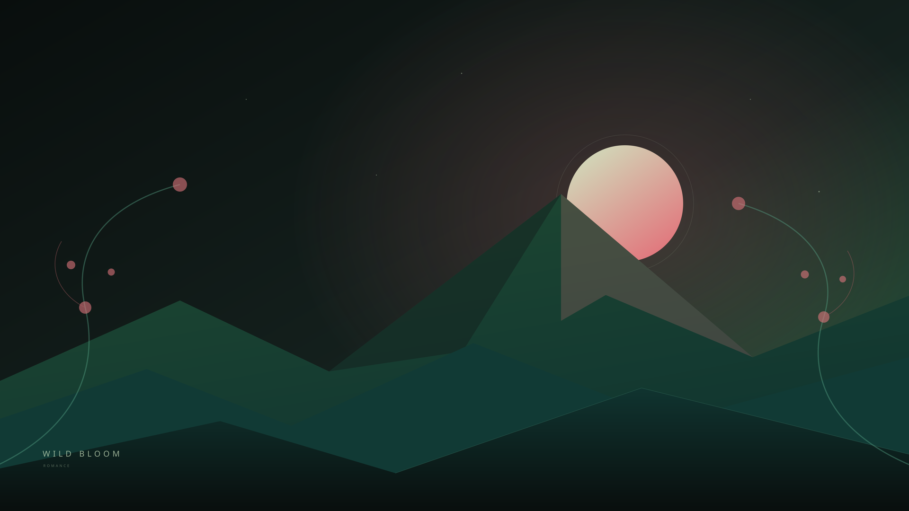</a>
    </td>
    <td width="50%" align="center">
      <a href="assets/screenshots/wild-bloom.png">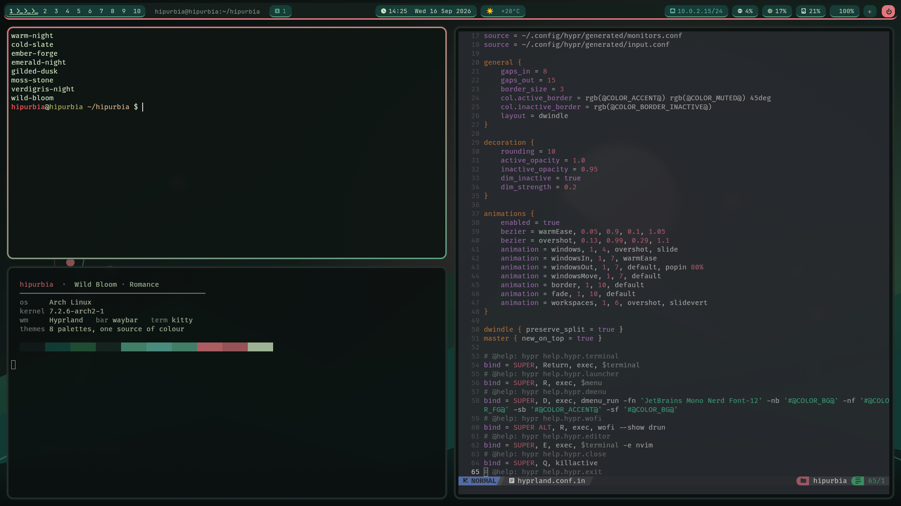</a>
    </td>
  </tr>
  <tr>
    <td colspan="2" align="center"><b>Wild Bloom</b> · <sub>Romance · <code>data/themes/wild-bloom.conf</code> · vine</sub></td>
  </tr>
</table>

## The surfaces it draws itself

<table>
  <tr>
    <td width="33%" align="center"><a href="assets/screenshots/overlay-power.png">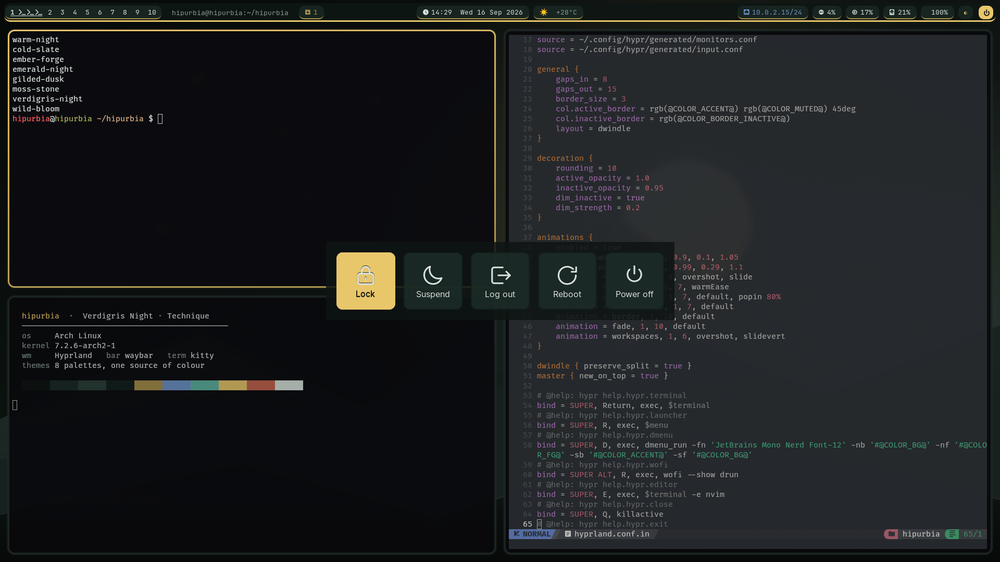</a></td>
    <td width="33%" align="center"><a href="assets/screenshots/overlay-theme.png">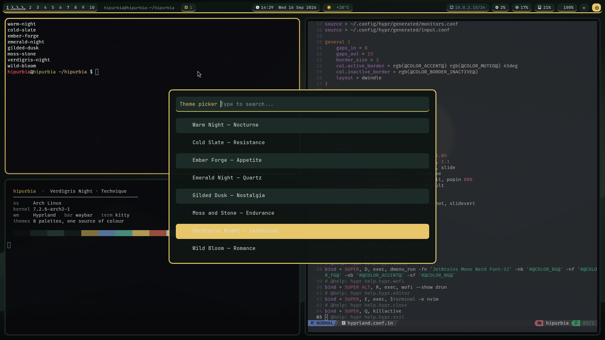</a></td>
    <td width="33%" align="center"><a href="assets/screenshots/overlay-help.png">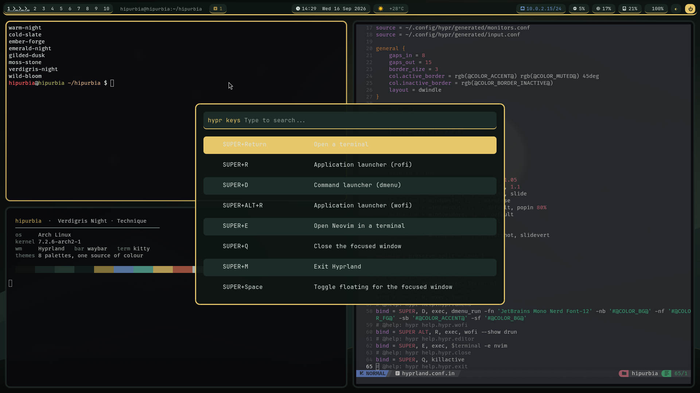</a></td>
  </tr>
  <tr>
    <td align="center"><b>Power menu</b><br><sub><code>Super+Shift+Q</code> · nwg-bar, entries generated per run in the session language, icons drawn from the palette and rasterized at start</sub></td>
    <td align="center"><b>Theme picker</b><br><sub><code>Super+Shift+T</code> · the catalogue itself, read from <code>data/themes/</code>, never a copy of it</sub></td>
    <td align="center"><b>Help pane</b><br><sub><code>F1</code>–<code>F5</code> · every bind, described in the session language, from <code>data/help-registry.tsv</code></sub></td>
  </tr>
</table>

Nothing in those three is a committed English render. The labels come from `i18n/`, the actions
never do: a translation can change what a button says and cannot change what it does.

## What is reproduced

A reproducible, security-reviewed version of my real Arch Linux workstation: Wayland desktop, launchers, editor, audio/Bluetooth tuning, security services, storage design and maintenance automation.

> This is not a raw home-directory dump. It preserves the architecture and behavior while removing credentials, device IDs, UUIDs, hostnames, private paths, personal application inventories and private media.


| Layer | Components | Engineering focus |
|---|---|---|
| Desktop | Hyprland, Waybar, Kitty, Dunst | Keyboard-first tiling and one palette at a time, rendered rather than hand-edited |
| Launchers | Rofi, dmenu, Wofi | Three real entry points, consistently styled where supported |
| Editor | Neovim, NvChad, Avante, LSP, Treesitter | Locked plugins, Wayland clipboard and one integrated AI interface |
| Audio | PipeWire, PipeWire-Pulse, WirePlumber | 48/96 kHz graph, underrun headroom and selectable Bluetooth policy |
| Bluetooth | BlueZ, Blueman | Privacy, secure connections and resilient reconnection |
| Security | UFW, ClamAV, rkhunter, Lynis, KeePassXC | Default-deny inbound firewall, fresh signatures and scheduled audits |
| Storage | Btrfs system/home + native and shared data tiers | Fast system disk, separated bulk data, safe optional mounts |
| Deployment | Pacman manifests + GNU Stow | Reviewed dependencies, reversible conflicts and idempotent links |
| Session | greetd + tuigreet | Optional generic graphical login without machine-bound display-manager state |
| Automation | systemd task templates + JSON runner | Reusable services, sync jobs, watchdogs and schedules without private parameters |
| VM validation | QEMU/KVM + official Arch cloud image | Real isolated package installation, deployment and startup checks |
| Publication | Custom privacy scanner + Gitleaks | Scan source candidates, tracked tree and Git history |

## Quick start

```bash
git clone https://github.com/gitsual/hipurbia.git
cd hipurbia
./scripts/bootstrap.sh --dry-run
./scripts/check.sh
```

Install official packages and deploy all user configuration:

```bash
./scripts/bootstrap.sh
```

Apply the reviewed system profiles only after a dry run:

```bash
./scripts/apply-system.sh --dry-run
./scripts/bootstrap.sh --no-install --system
```

For a complete generic graphical login, add the opt-in profile:

```bash
./scripts/bootstrap.sh --desktop-login
./scripts/apply-system.sh --dry-run --desktop-login
```

Validate the current tree in a real isolated Arch VM, or keep a graphical VM for manual testing:

```bash
./scripts/test-vm.sh
./scripts/test-vm.sh --gui
```

Deploy selected packages:

```bash
./scripts/deploy.sh hypr waybar nvim audio
```

Existing files are never deleted. Conflicts move to a timestamped backup under `${XDG_STATE_HOME:-$HOME/.local/state}/hipurbia/backups/`. Stow runs with `--no-folding`, so local hardware overlays cannot write through a linked directory into the repository.

Two things are not stowed because they differ per machine: the Waybar config and the Hyprland fragments for monitors, input devices and the GPU. They are rendered from detected hardware facts into `$XDG_CONFIG_HOME`, never into the checkout, and replaced files go to the same backup location:

```bash
./scripts/hardware-facts.sh --emit     # detect once; correct with the override file
./scripts/render-config.sh --deploy    # or --dry-run to see what would change
./scripts/render-config.sh --check-drift
```

`scripts/bootstrap.sh` runs both steps after Stow.

## Repository map

```text
dotfiles/              User-level Stow packages
  hypr/                Compositor, lock screen and desktop actions
  waybar/ kitty/ dunst/
  rofi/ wofi/          Launchers and power menu
  nvim/                Full active editor configuration and lockfile
  audio/               Portable PipeWire/WirePlumber baseline
  theme/ shell/        GTK/KDE visual defaults and safe shell baseline
  security/            User malware timer and audit command
  automation/          Generic local service and timer framework
system/                Reviewed system-level templates, including optional login
profiles/              Optional audio, automation and VM package profiles
render/                Deploy-time templates rendered from hardware facts and settings into $XDG_CONFIG_HOME
settings.example       The user settings file (language axes) with its defaults
templates/             Themed templates rendered from data/theme.conf into dotfiles/
packages/              Base and composable official/AUR manifests
docs/                  Architecture, coverage, VM validation and publication copy
scripts/               Bootstrap, deploy, render, audit and real-VM test tools
```

## Documentation

- [Storage architecture](docs/disk-architecture.md)
- [Audio and Bluetooth](docs/audio-bluetooth.md)
- [Security architecture](docs/security-architecture.md)
- [Neovim and Avante](docs/neovim.md)
- [Services and maintenance](docs/services.md)
- [Portable automations](docs/automations.md)
- [Virtual-machine validation](docs/virtual-machine.md)
- [The downloadable image](docs/vm-image.md)
- [Sanitization decisions](docs/design-notes.md)
- [Workstation coverage matrix](docs/coverage-matrix.md)
- [Destination tests: what was verified where](docs/destination-tests.md)
- [Publication audit](docs/audit-report.md)

## Hardware profiles

The portable Hyprland baseline does not force a GPU. `render/hypr/generated/hardware.conf.in` emits the NVIDIA Wayland environment only when the detected facts say NVIDIA is the sole GPU, and a software cursor on NVIDIA and virtual machines; every other machine gets an empty fragment. To change what was detected, write the corrected fact to `~/.config/hipurbia/hardware-facts.override` and re-run `scripts/render-config.sh --deploy`.

The driver stack itself comes from `data/gpu-catalogue.tsv` through `scripts/gpu-setup.sh`, which is a dry run unless told otherwise:

```bash
./scripts/gpu-setup.sh                  # families, packages, kernel headers and warnings; installs nothing
./scripts/gpu-setup.sh --list           # every family and how it was verified
sudo -v && ./scripts/gpu-setup.sh --apply
./scripts/gpu-setup.sh --restore-config # put back the previous Hyprland hardware fragment
```

A hybrid machine gets both families plus `nvidia-prime`; a DKMS stack gets the headers of every installed kernel; Secure Boot with a DKMS module is warned about, not hidden. `--gpu FAMILY` overrides the detection only for a family the facts also see (or `generic`), and refuses anything else with exit 3. Audio device node names are rendered locally by `scripts/configure-audio.py` and are never committed.

## The wallpaper and the logo are rendered too

`scripts/make-wallpaper.sh` draws each wallpaper from `templates/wallpaper/base.svg.in` in the
theme's own colours, and lays an ornament on top only when the theme has *earned* one. A theme
declares its layer with `# @ornament:`, and the script refuses the claim unless the pairing is an
affinity in the corpus matrix (distance ≤ 2) or the theme names an aesthetic from
`data/aesthetics.tsv` that permits ornament and actually carries its canonical colours. A theme
that asks for filigree it cannot justify fails the build; it is not quietly downgraded to a plain
background, because the claim is wrong and saying so is the point.

The default Warm Night · Nocturne wallpaper is bundled as SVG source and a 4K PNG. The desktop
starts it with `swaybg`, including on virtual GPUs without accelerated rendering.

The eight at the top of this page are not a curated selection, they are the whole catalogue:
one command redraws every one of them at 4K from the theme files alone, and the copies under
`assets/wallpapers/` are those renders scaled down for the web.

```bash
./scripts/make-wallpaper.sh --all          # every theme, SVG + 3840×2160 PNG, into dist/wallpapers
./scripts/make-wallpaper.sh --theme wild-bloom --no-raster
```

The banner at the top of this page goes through the same door. `scripts/make-logo.sh` renders
`templates/brand/logo.svg.in` from a theme file into `assets/logo.svg` and rasterizes it, so the
wordmark, the swatch row under it and the mark itself are that palette and not a memory of it:

```bash
./scripts/make-logo.sh --theme moss-stone     # the banner in any palette in the catalogue
```

The mark is the half-filled circle the status bar already uses for its theme button. The project's
one symbol is the control that changes everything else, which felt like the honest choice.

## Optional selectors

`bootstrap.sh --list-selectors` prints the optional package sets and whether each applies to this machine; `--desktop` adds the everyday applications (`packages/desktop.txt`: browser, file manager, image and PDF viewers, media player, office suite) on top of the base profile, which a test keeps byte-identical without the flag.

## Ricing tools

`bootstrap.sh --ricer` adds the customisation set (`packages/ricer.txt`, all from the official repositories: `cliphist`, `swappy`, `wf-recorder`, `nwg-look`, `qt6ct`, `kvantum`, `nwg-bar`). `hypridle` is part of the base and starts with the session: lock after five minutes, screen off after ten, suspend after thirty. `Super+Shift+Q` opens the `nwg-bar` power menu beside the rofi one on `Super+Shift+E`, with the same five entries: both read their labels from `i18n/` at run time, and both are drawn in the palette — the five icons are the repository's own SVG templates, rendered like every other themed surface and rasterized to PNG at start because librsvg no longer ships the pixbuf loader GTK would need to read them directly. `Super+Shift+T` opens the theme picker over whatever is on screen, the same catalogue the wizard walks, also on the `◐` button in the bar. `Super+V` picks from the clipboard history. `packages/aur.txt` stays empty and `wlogout` is never installed, both pinned by a test.

## Workspaces

Ten numbered workspaces, `Super+1` to `Super+9` and `Super+0` for the tenth, `Super+Shift` to move a window there, and `Super+[` / `Super+]` to walk them with wraparound. Special workspaces are never part of that sequence. Waybar shows all ten by number, each occupied one followed by a glyph per window (`dotfiles/waybar/.config/waybar/workspace-icons.json`: class first, then a class prefix, then a title fragment, then a default), the active one underlined and an urgent one in italics. The strip is a `custom/ws` module fed by `ws-refresh.sh`, a `socat` listener on Hyprland's event socket that debounces a burst, takes one `hyprctl` snapshot and signals Waybar; nothing polls.

## Help panes

`F1` to `F5` open a rofi pane with the keys of Hyprland, the browser, the shell, the editor and the system, described in the session language. The rows come from `data/help-registry.tsv`; the Hyprland pane also reads `hyprctl binds -j`, and a live bind the registry does not know is shown as `UNREGISTERED` rather than dropped. Every bind in the Hyprland template carries a `# @help:` line above it, and `check.sh` refuses a bind without one, a registry row without a bind, or a label missing from the English table. A description is text: selecting a row acts on the registry's action column, never on the translation. `docs/keys.md` is the same registry for readers without a session.

## Language axes

Locale, console keymap and Hyprland keyboard layout are three separate choices, and each has exactly one writer. They are read from `~/.config/hipurbia/settings` (see `settings.example`; a missing file means the source workstation's values):

```bash
sudo -v && ./scripts/apply-system.sh --locale --keymap   # /etc/locale.conf + locale-gen, /etc/vconsole.conf
./scripts/render-config.sh --deploy                       # kb_layout into ~/.config/hypr/generated/input.conf
```

A test pins the single-writer rule and another that `LC_ALL=C` is only ever pinned at parser call sites, never exported.

The base profile installs Noto (Latin, CJK, emoji) so any script renders; the VM gate asks `fc-match` by code point, not by family name. An input method is a fourth setting, `ime=fcitx5` (default `none`): it adds the fcitx5 environment and daemon start to the input fragment and nothing else, and `bootstrap.sh --ime` installs fcitx5 with Mozc.

## Status bar

The bar is rendered per machine from `render/waybar/config.in`, so a module appears only when the hardware answers for it: bluetooth needs an adapter, backlight a panel, the NVIDIA temperature an NVIDIA card. CPU temperature works the same way but needs more than a yes: `cpu_temp_path` carries the `/sys` file the sensor actually lives in, chosen by driver name (`k10temp`, `zenpower`, `coretemp`, then `acpitz`) rather than by hwmon index, because that index is assigned in probe order and differs between machines. A VM reports `none` and the module is not placed at all.

The network module shows the address inline (`{ipaddr}/{cidr}`) instead of hiding it in a tooltip, and click-toggles to the interface name; the bluetooth tooltip enumerates the connected devices. Weather is a fifth setting, `weather_location` (default `auto`, which lets wttr.in geolocate by IP) — set it to a place name or airport code to ask about somewhere else, and note that the module makes an outbound request every half hour either way.

## First run

The first session starts `hipurbia-welcome` and no later one does: it writes a marker, and `--first-run` is a no-op afterwards. Three questions and a ten-step tour, all reversible, all applied where you can see them.

The language comes first, because it is the one answer that changes every question after it: the wizard writes `/etc/locale.conf` through `apply-system.sh --locale` and reloads its own tables on the spot, so the rest of the tour is already in the language just chosen. It says plainly that the bar, the launcher and the help panes read `LANG` once, at login, and will follow on the next one. Every string the wizard says comes from `i18n/`, like every other surface; a test refuses a Spanish literal in the program itself.

The keyboard is next: eight layouts, each labelled in its own language, written to both the console keymap and the compositor layout. Then the theme, applied live as you move through the catalogue — `scripts/apply-theme.sh` renders the chosen palette over the stowed stylesheets and reloads the wallpaper, the bar, the borders and the notifications, so the whole room changes under the cursor instead of a setting changing in a file you cannot see. Choosing the default again restores the committed symlinks exactly, which is what keeps the theme-drift gate meaningful.

Then the tour, which waits for you to actually press the binding and notices when you do, instead of listing it. It calls the modifier **Windows**, because that is what is printed on the key. It covers opening a window and closing it, moving between the ten desktops and carrying a window to another one, the F1–F5 help panels and the Escape that dismisses them, what each side of the bar is for and where your IP address is, the volume, and `pacman` in both directions — installing Chromium and then removing it with `-Rns`, because installing is easy to try and undoing it is the part that actually teaches the package manager.

Run `hipurbia-welcome` again whenever you want; it changes only what you confirm. To change the theme without it: `scripts/apply-theme.sh --list`, then `scripts/apply-theme.sh --theme NAME`.

The published image meets you at the graphical login first: ReGreet inside a cage kiosk, in the palette, with Hyprland as its default session, so nothing has to be typed to reach the desktop.

## Graphical login

`--desktop-login` installs greetd with tuigreet, as before. `bootstrap.sh --gui-greeter` (or `apply-system.sh --greeter`) installs ReGreet inside a cage kiosk instead, styled from the palette (`templates/system/etc/greetd/regreet.css.in`). The greeter has two language axes of its own, rendered from the settings file into greetd's command: `LANG` for the greeter process and `XKB_DEFAULT_LAYOUT` for the keyboard cage hands it. Each is written in exactly one place, pinned by the same test as the session's axes. The test VM keeps its passwordless autologin, frozen byte-for-byte.

## Verification

`scripts/check.sh` validates shell, Python, JSON, Lua, systemd units, all package manifests, symlinks, file types and privacy patterns, verifies every bundled asset against `data/asset-manifest.tsv`, runs the behaviour tests in `tests/cases/`, runs Gitleaks, performs both a dry run and a two-pass deployment regression in temporary HOMEs, and checks deployment integrity: Stow and the machine-specific renders never claim the same path, never write into the checkout, and every package and Hyprland fragment is accounted for. `scripts/test-neovim.sh` performs the separate clean editor installation without calling external AI services. `scripts/test-vm.sh` installs and exercises the current tree in an official Arch QEMU/KVM guest. Publication also requires scanning the exact staged Git objects and resulting commit before push.

Every claim in this repository rests on author-run evidence, not CI: these checks are run by hand on the author's machine and in a local VM before publication. There is no hosted pipeline re-running them on each commit, and nothing here should be read as if there were. `docs/destination-tests.md` says, claim by claim, whether something was verified on the author's hardware, in the VM, or not at all; a test refuses a row without one of those three answers.

## License

MIT
