<div align="center">


<p>
<em>A <strong>vivac</strong> is the camp you pitch from what you carry and strike at dawn.<br>
This is an Arch Linux workstation you can rebuild from nothing.</em><br>
<strong>What you carry is one file — twenty-odd lines of colour. The wallpaper, the bar, the borders and this banner are rendered from it, none of them painted by hand. There are eight such files.</strong>
</p>

<p>
  
  
  
  
  
</p>

<a href="#-three-ways-in"><strong>Get it</strong></a> ·
<a href="#-the-eight"><strong>The eight</strong></a> ·
<a href="#-60-second-tour"><strong>60-second tour</strong></a> ·
<a href="#-how-colour-works"><strong>How colour works</strong></a> ·
<a href="#-first-run"><strong>First run</strong></a> ·
<a href="#-verification"><strong>Verification</strong></a>

</div>

---

<a href="#-the-eight"></a>

<div align="center">

**os** Arch Linux · **wm** [Hyprland](https://hyprland.org) · **bar** Waybar · **term** kitty · **shell** bash<br>
**editor** Neovim / NvChad · **launchers** rofi · wofi · dmenu · **notify** dunst<br>
**lock** hyprlock + hypridle · **wallpaper** swaybg · **font** JetBrains Mono Nerd Font<br>
**greeter** ReGreet in a cage kiosk · **colour** `data/theme.conf` → `templates/` → `dotfiles/`

<br>

<sub>Two kinds of image on this page, and no third kind. The wallpapers and the banner are
<b>rendered</b> — <code>scripts/make-wallpaper.sh --all</code> and <code>scripts/make-logo.sh</code> turn
<code>data/themes/*.conf</code> into SVG and then into pixels, so the artwork is a build artifact like
everything else here. Every desktop below is a <b>real <code>grim</code> capture</b> taken inside the
QEMU/KVM guest that <code>scripts/test-vm.sh</code> builds from this tree — same commit, same deploy.
No mockups, no compositing, nothing hand-painted.</sub>

</div>

---

## 📥 Three ways in

<table>
<tr>
<th width="33%">Boot the image</th>
<th width="33%">Install it on Arch</th>
<th width="33%">Try the tree in a VM</th>
</tr>
<tr>
<td valign="top">

Nothing to build. The
[releases page](https://github.com/gitsual/hipurbia/releases)
carries the same workstation this tree builds, already provisioned, as a disk
you can boot.

```sh
cat vivac.qcow2.part* >vivac.qcow2
sha256sum -c SHA256SUMS
./scripts/run-vm-image.sh
```

For **VirtualBox** or **VMware**, download `vivac.ova.part*` instead,
reassemble it the same way and import the appliance — no flags to get wrong.
Accounts are `user`/`user` and `root`/`toor`, by convention rather than by
secret: the image ships `sshd` installed and **disabled**, so a published
password is not a door standing open.

→ [The downloadable image](docs/vm-image.md)

</td>
<td valign="top">

On a machine already running Arch. Nothing is deleted: a conflicting file moves
to a timestamped backup under `$XDG_STATE_HOME/vivac/backups/`.

```sh
git clone https://github.com/gitsual/hipurbia.git
cd hipurbia
./scripts/bootstrap.sh --dry-run
./scripts/bootstrap.sh
```

System-level profiles are opt-in and are never applied by that command; each
one has a dry run of its own. `bootstrap.sh --list-selectors` prints the
optional sets and says which apply to this machine.

→ [Install](#-install)

</td>
<td valign="top">

Neither of the above, on any distribution with QEMU/KVM. The same guest the
gates use: a real Arch cloud image, provisioned from the working tree.

```sh
./scripts/test-vm.sh        # headless, asserts, exits
./scripts/test-vm.sh --gui  # a window you can click around in
```

It builds from whatever is checked out, so it is also how a change to this
repository is tried before it reaches the image above.

→ [Virtual-machine validation](docs/virtual-machine.md)

</td>
</tr>
</table>

---

## 🎨 Why this exists

Most desktop repositories are a folder of hand-edited stylesheets that agreed with each
other once. Change the accent colour and you are editing eight files by hand, and the ninth
— the one you forgot — is the one people see.

**Here the palette is the only place a colour is written.** `data/theme.conf` holds it,
everything that carries a colour lives in `templates/` as a template, and `dotfiles/` is the
*render*. A committed render that disagrees with its template fails the build. A colour that
exists in no corpus fails the build. A theme that claims an ornament it has not earned fails
the build — it is not quietly downgraded, because the claim is what is wrong.

### ✨ What you get

- **🎨 Eight palettes, one switch.** `Super+Shift+T`, the `◐` in the bar, or `apply-theme.sh --theme NAME` — wallpaper, bar, borders, notifications, launcher and **every terminal already open**.
- **🖼️ Artwork that is generated, not drawn.** Eight 4K wallpapers and the banner above come out of the theme files by running a script.
- **🌍 Three language axes, one writer each.** Locale, console keymap and compositor layout are separate choices; a test pins that exactly one place writes each.
- **🧭 A first run that teaches.** Three questions and a ten-step tour that waits for you to actually press the key.
- **🖥️ No GPU assumed.** Hardware facts are detected, rendered into `$XDG_CONFIG_HOME`, and never written into the checkout.
- **🔐 Sanitized on purpose.** No credentials, device IDs, UUIDs, hostnames or private paths — enforced by a scanner over the staged objects and the Git history, not by memory.
- **✅ 46 gates before anything ships.** Shell, Python, JSON, Lua, systemd units, manifests, asset checksums, privacy patterns, a two-pass deployment regression and a real Arch VM.

### ⚡ 60-second tour

```bash
git clone https://github.com/gitsual/hipurbia.git && cd hipurbia
./scripts/bootstrap.sh --dry-run   # what it would install and link, touching nothing
./scripts/check.sh                 # the whole gate suite
./scripts/test-vm.sh --gui         # the real thing, in a QEMU/KVM Arch guest
```

Nothing above needs root, and nothing above writes outside the checkout.

---

## 🖼️ The eight

Left column is the wallpaper the theme renders. Right column is that same theme running,
captured inside the VM. Same commit, same deploy, same palette file.

<table>
  <tr>
    <td width="50%" align="center"><sub><b>rendered</b> — <code>make-wallpaper.sh</code></sub></td>
    <td width="50%" align="center"><sub><b>captured</b> — <code>grim</code>, inside the VM</sub></td>
  </tr>
  <tr>
    <td width="50%" align="center"><a href="assets/wallpapers/bad-romance.png"></a></td>
    <td width="50%" align="center"><a href="assets/screenshots/bad-romance.png">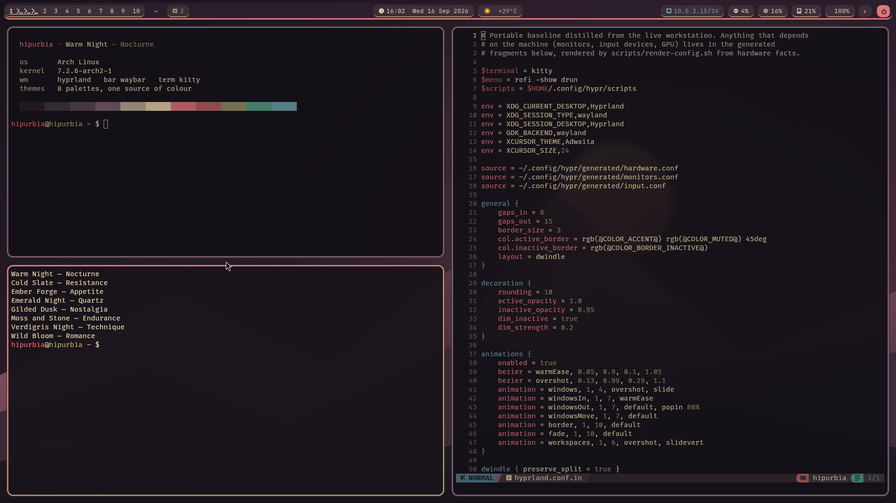</a></td>
  </tr>
  <tr>
    <td colspan="2" align="center"><b>Bad Romance</b> · <sub>Nocturne · <code>data/theme.conf</code> · no ornament — the base composition alone</sub></td>
  </tr>
  <tr>
    <td width="50%" align="center"><a href="assets/wallpapers/metropolis.png">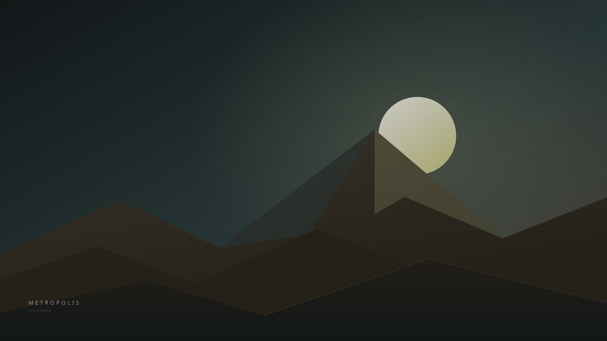</a></td>
    <td width="50%" align="center"><a href="assets/screenshots/metropolis.png"></a></td>
  </tr>
  <tr>
    <td colspan="2" align="center"><b>Metropolis</b> · <sub>Resistance · <code>data/themes/metropolis.conf</code> · no ornament</sub></td>
  </tr>
  <tr>
    <td width="50%" align="center"><a href="assets/wallpapers/carmen.png">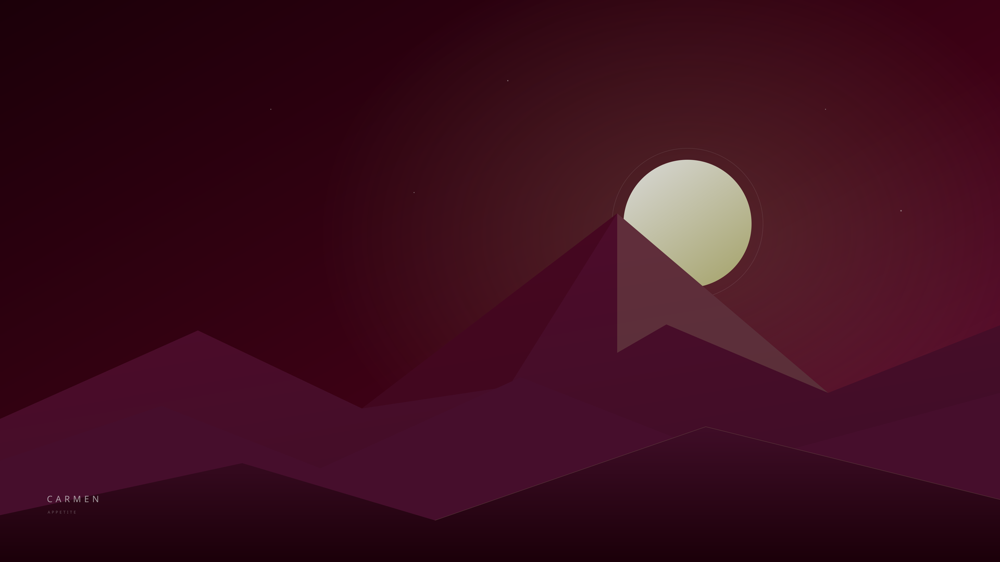</a></td>
    <td width="50%" align="center"><a href="assets/screenshots/carmen.png"></a></td>
  </tr>
  <tr>
    <td colspan="2" align="center"><b>Carmen</b> · <sub>Appetite · <code>data/themes/carmen.conf</code> · no ornament</sub></td>
  </tr>
  <tr>
    <td width="50%" align="center"><a href="assets/wallpapers/northern-lights.png"></a></td>
    <td width="50%" align="center"><a href="assets/screenshots/northern-lights.png">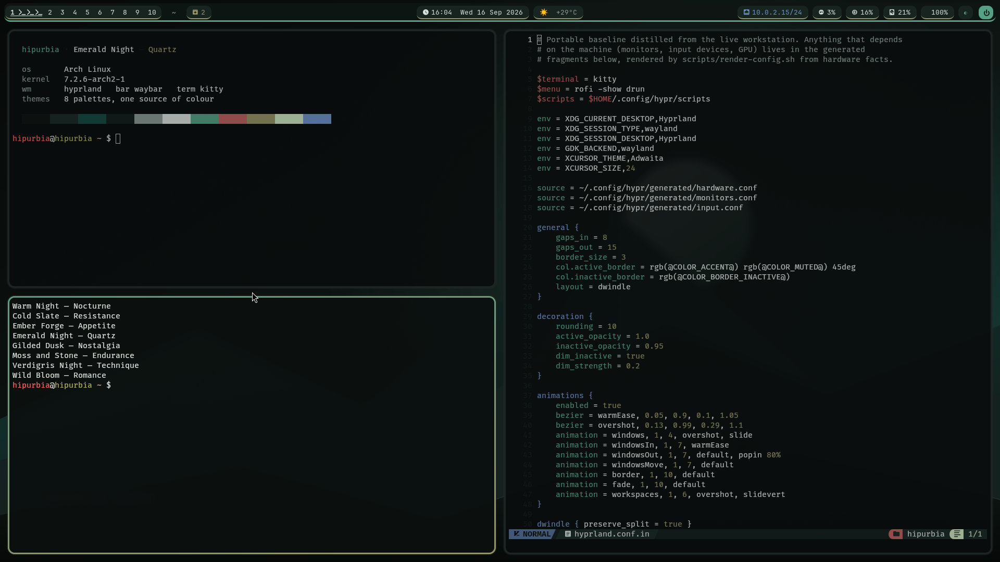</a></td>
  </tr>
  <tr>
    <td colspan="2" align="center"><b>Northern Lights</b> · <sub>Quartz · <code>data/themes/northern-lights.conf</code> · no ornament</sub></td>
  </tr>
  <tr>
    <td width="50%" align="center"><a href="assets/wallpapers/gatsby.png"></a></td>
    <td width="50%" align="center"><a href="assets/screenshots/gatsby.png">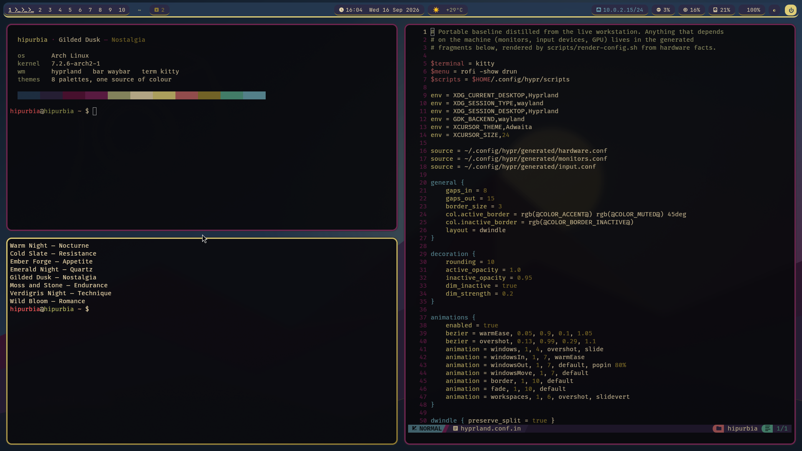</a></td>
  </tr>
  <tr>
    <td colspan="2" align="center"><b>Gatsby</b> · <sub>Nostalgia · <code>data/themes/gatsby.conf</code> · no ornament</sub></td>
  </tr>
  <tr>
    <td width="50%" align="center"><a href="assets/wallpapers/the-hermit.png"></a></td>
    <td width="50%" align="center"><a href="assets/screenshots/the-hermit.png">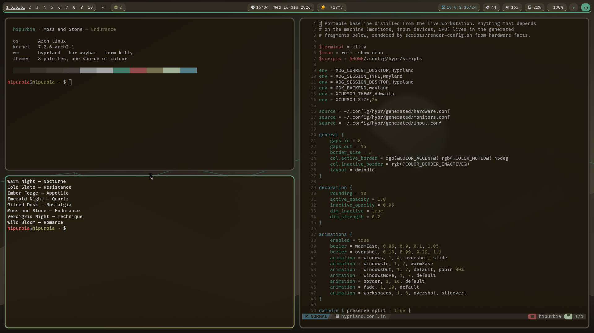</a></td>
  </tr>
  <tr>
    <td colspan="2" align="center"><b>The Hermit</b> · <sub>Endurance · <code>data/themes/the-hermit.conf</code> · no ornament</sub></td>
  </tr>
  <tr>
    <td width="50%" align="center"><a href="assets/wallpapers/cosmos.png"></a></td>
    <td width="50%" align="center"><a href="assets/screenshots/cosmos.png">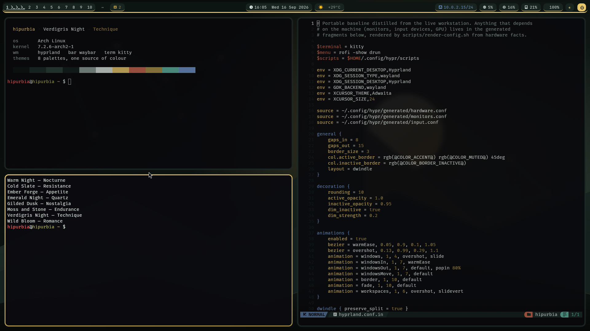</a></td>
  </tr>
  <tr>
    <td colspan="2" align="center"><b>Cosmos</b> · <sub>Technique · <code>data/themes/cosmos.conf</code> · constellation</sub></td>
  </tr>
  <tr>
    <td width="50%" align="center"><a href="assets/wallpapers/persephone.png"></a></td>
    <td width="50%" align="center"><a href="assets/screenshots/persephone.png">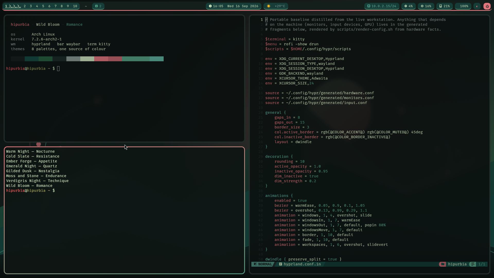</a></td>
  </tr>
  <tr>
    <td colspan="2" align="center"><b>Persephone</b> · <sub>Romance · <code>data/themes/persephone.conf</code> · vine</sub></td>
  </tr>
</table>

### The surfaces it draws itself

Every picture below is the same three-pane desktop with one surface opened on top of it, each
in a different palette. The surface is not launched by a command repeated here: the capture
script reads the deployed Hyprland config and runs whatever that key is bound to, so a
screenshot cannot show something the key no longer does.

<table>
  <tr>
    <td width="33%" align="center"><a href="assets/screenshots/surface-power.png">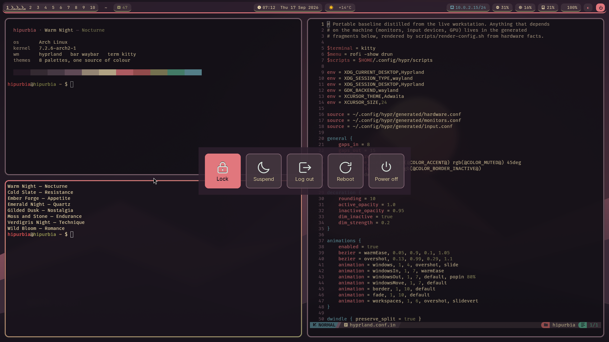</a></td>
    <td width="33%" align="center"><a href="assets/screenshots/surface-power-rofi.png">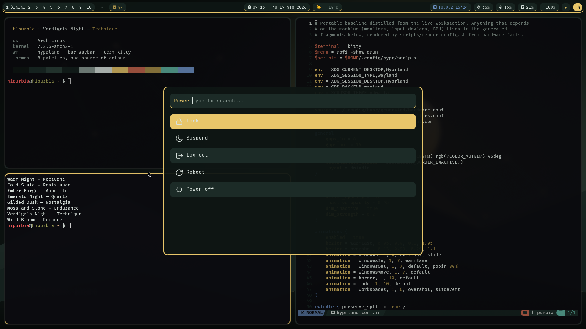</a></td>
    <td width="33%" align="center"><a href="assets/screenshots/surface-theme.png">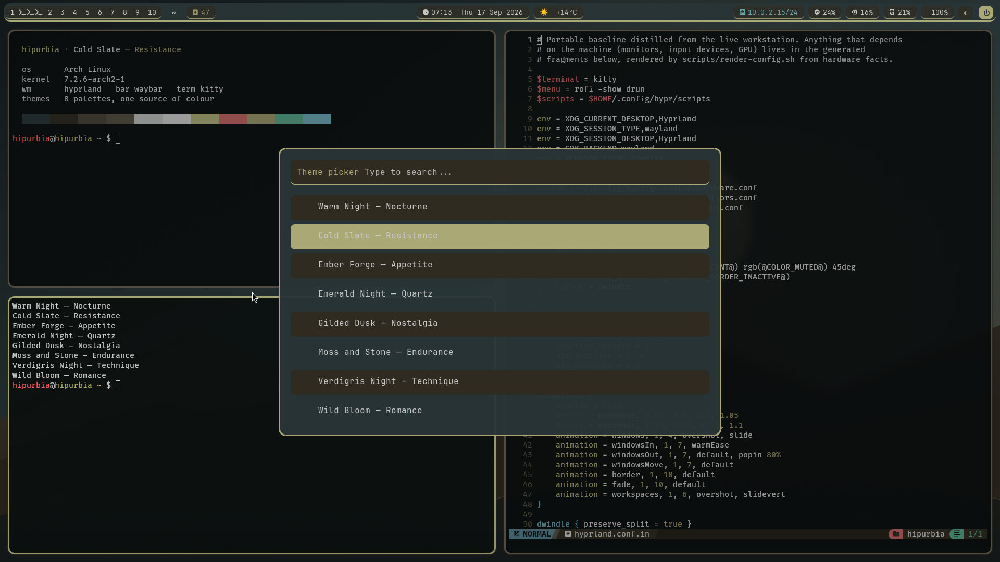</a></td>
  </tr>
  <tr>
    <td align="center"><b>Power menu</b><br><sub><code>Super+Shift+Q</code> · nwg-bar, entries generated per run in the session language, icons drawn from the palette and rasterized at start</sub></td>
    <td align="center"><b>Power menu, the other one</b><br><sub><code>Super+Shift+E</code> · the same actions through rofi, for a session that never had nwg-bar</sub></td>
    <td align="center"><b>Theme picker</b><br><sub><code>Super+Shift+T</code> · the catalogue itself, read from <code>data/themes/</code>, never a copy of it</sub></td>
  </tr>
  <tr>
    <td align="center"><a href="assets/screenshots/surface-help-hypr.png">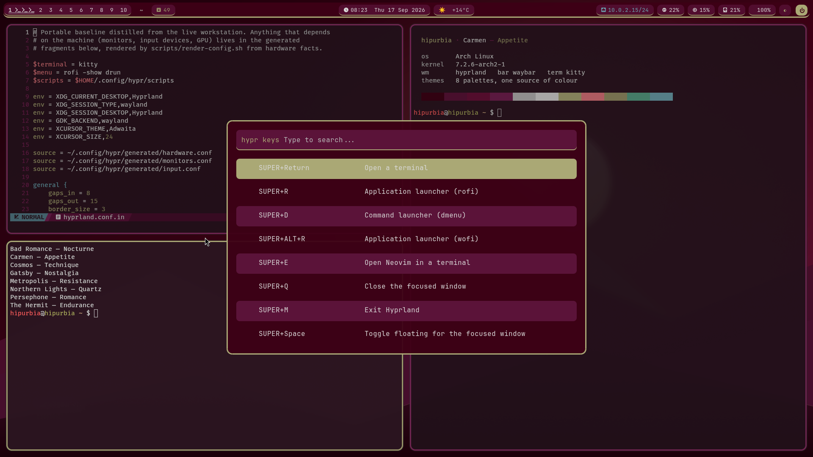</a></td>
    <td align="center"><a href="assets/screenshots/surface-help-browser.png">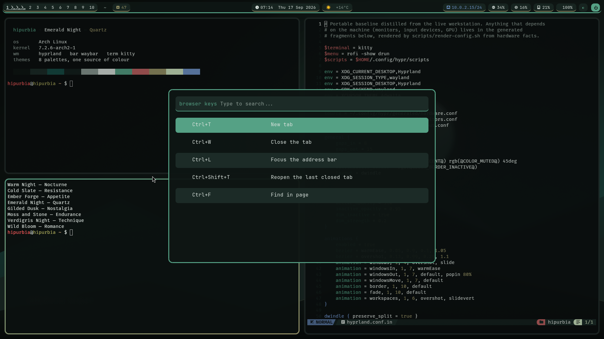</a></td>
    <td align="center"><a href="assets/screenshots/surface-help-shell.png">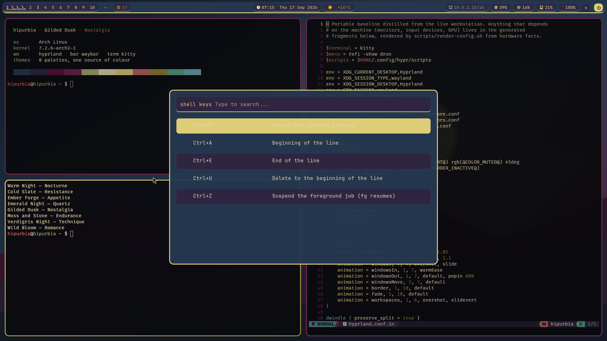</a></td>
  </tr>
  <tr>
    <td align="center"><b>Help · Hyprland</b><br><sub><code>F1</code> · every bind, described in the session language, from <code>data/help-registry.tsv</code></sub></td>
    <td align="center"><b>Help · browser</b><br><sub><code>F2</code> · a live bind the registry does not carry shows up as <code>UNREGISTERED</code></sub></td>
    <td align="center"><b>Help · shell</b><br><sub><code>F3</code> · selecting a row acts on the registry's action, never on its description</sub></td>
  </tr>
  <tr>
    <td align="center"><a href="assets/screenshots/surface-help-editor.png">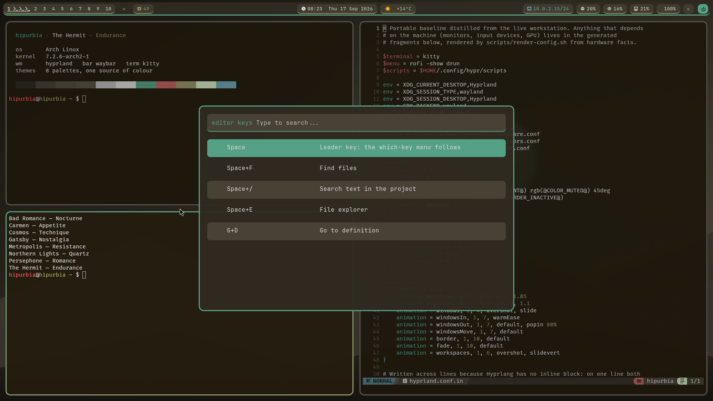</a></td>
    <td align="center"><a href="assets/screenshots/surface-help-system.png">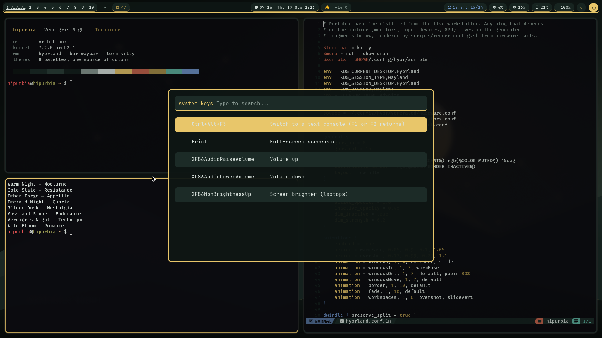</a></td>
    <td align="center"><a href="assets/screenshots/surface-launcher-rofi.png">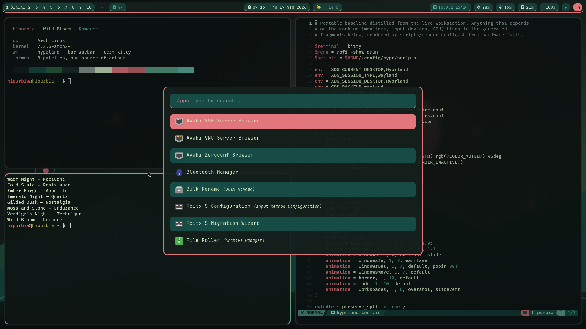</a></td>
  </tr>
  <tr>
    <td align="center"><b>Help · editor</b><br><sub><code>F4</code> · the editor's keys, from the same registry as the compositor's</sub></td>
    <td align="center"><b>Help · system</b><br><sub><code>F5</code> · rows whose action is a document open the file under <code>docs/</code></sub></td>
    <td align="center"><b>Launcher</b><br><sub><code>Super+R</code> · <code>rofi -show drun</code>, themed from the palette like everything else</sub></td>
  </tr>
  <tr>
    <td align="center"><a href="assets/screenshots/surface-launcher-wofi.png">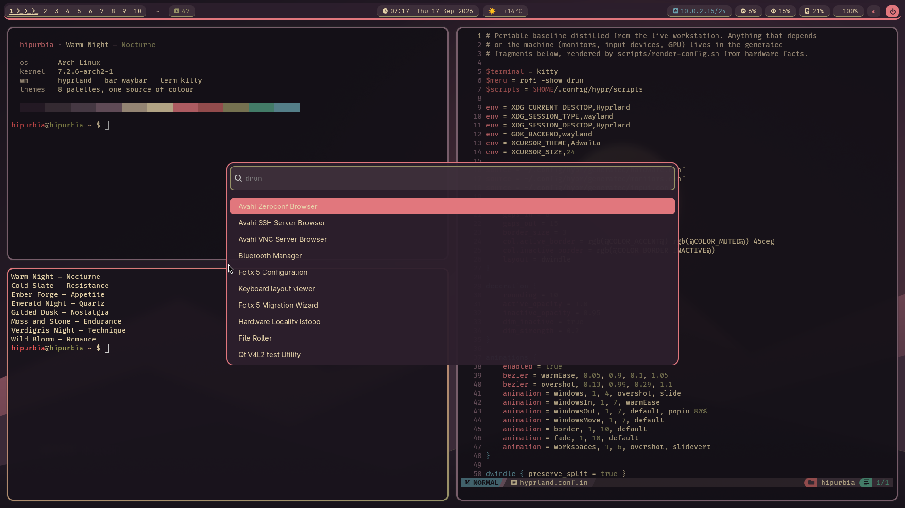</a></td>
    <td align="center"><a href="assets/screenshots/surface-launcher-dmenu.png">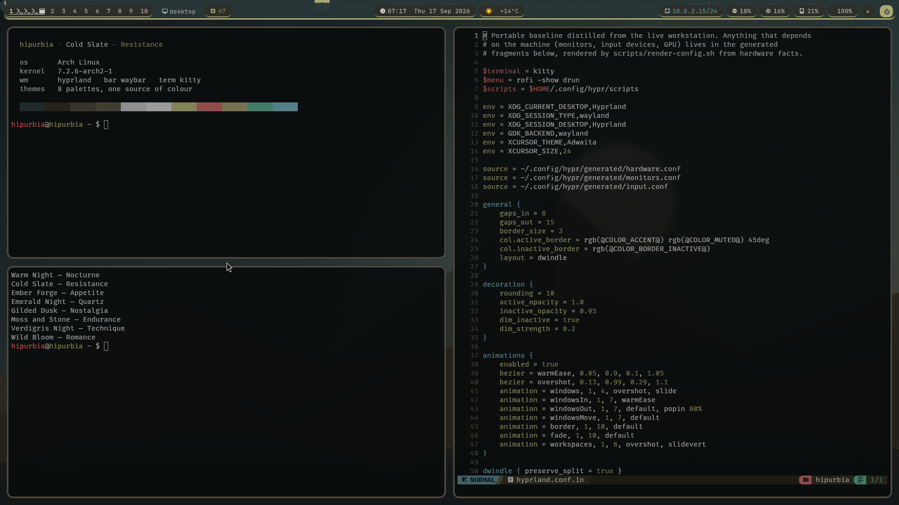</a></td>
    <td align="center"><a href="assets/screenshots/surface-clipboard.png">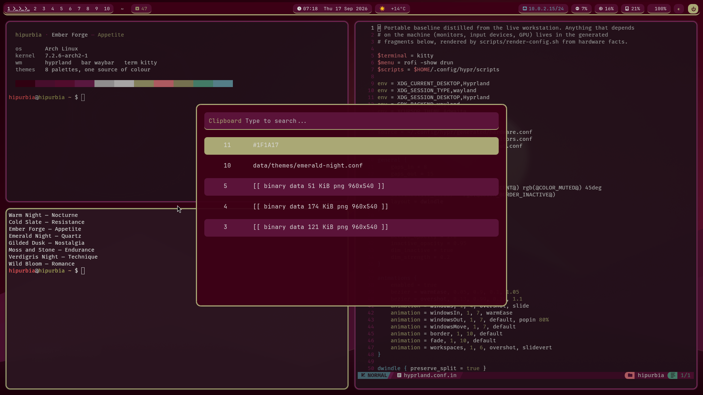</a></td>
  </tr>
  <tr>
    <td align="center"><b>Launcher, second opinion</b><br><sub><code>Super+Alt+R</code> · <code>wofi</code>, because a launcher you dislike should not be the only one</sub></td>
    <td align="center"><b>Launcher, last resort</b><br><sub><code>Super+D</code> · <code>dmenu_run</code>, its colours handed over on the command line by the render</sub></td>
    <td align="center"><b>Clipboard history</b><br><sub><code>Super+V</code> · <code>cliphist</code> through rofi; picking a row puts it back on the clipboard</sub></td>
  </tr>
  <tr>
    <td align="center"><a href="assets/screenshots/surface-welcome.png">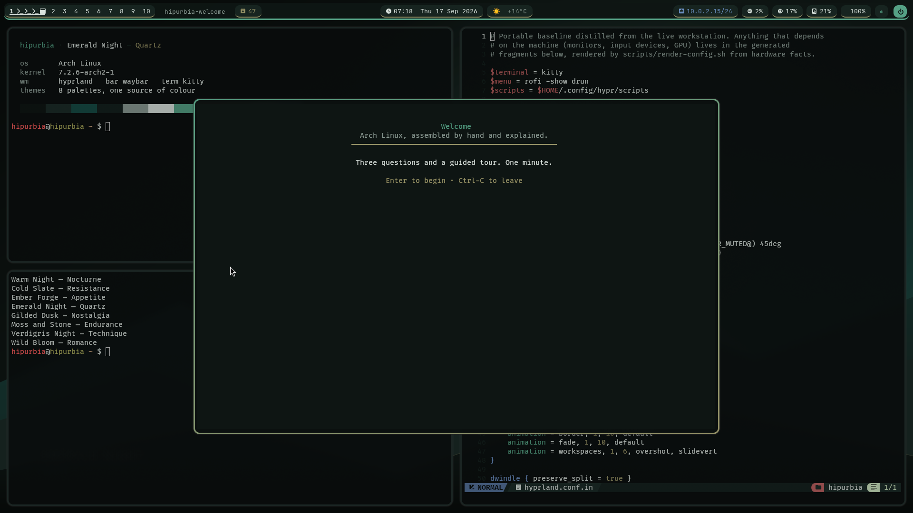</a></td>
    <td align="center"><a href="assets/screenshots/surface-notification.png">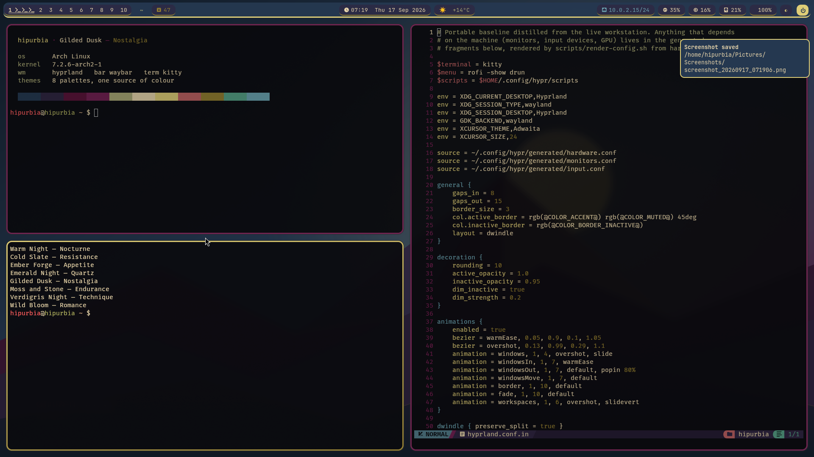</a></td>
    <td align="center"><a href="assets/screenshots/surface-lock.png">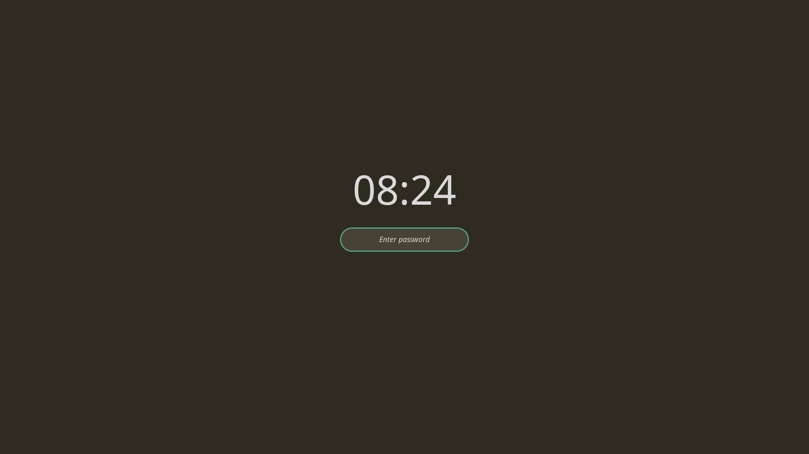</a></td>
  </tr>
  <tr>
    <td align="center"><b>Welcome</b><br><sub>first login · a terminal wizard on purpose: a desktop driven from the keyboard should not open by handing you a mouse</sub></td>
    <td align="center"><b>Notification</b><br><sub><code>Super+Shift+S</code> · dunst, naming the file the screenshot script actually wrote</sub></td>
    <td align="center"><b>Lock screen</b><br><sub><code>Super+L</code> · hyprlock, rendered from <code>hyprlock.conf</code> in the palette of the session it locked</sub></td>
  </tr>
</table>

Nothing here is a committed English render. The labels come from `i18n/`, the actions never do:
a translation can change what a button says and cannot change what it does.

---

## 🧬 How colour works

A theme is not a pile of stylesheets. `data/theme.conf` holds the palette; everything that
carries a colour lives in `templates/` and is *rendered* into `dotfiles/`;
`scripts/check-theme-drift.sh` fails the build when a committed render and its template
disagree. Switching palette re-renders over the stowed symlinks live, and choosing the default
again restores those symlinks byte for byte. Every colour must also exist in
`data/palette-corpus.tsv`: a colour with no cause is slop.

The terminal and the editor are part of that, not exceptions to it.
`templates/kitty/.config/kitty/kitty.conf.in` carries `TERMINAL_FG` and `TERMINAL_BG` like every
other themed file, and the terminals already open re-read it on `SIGUSR1` — the signal kitty
sends itself — so the palette lands in the window you are looking at instead of the next one you
open. Deploying does not undo any of this: `deploy.sh` restows the committed defaults and then
reapplies the theme named in `~/.config/vivac/settings`, because restowing the default render
over a live overlay used to undress the desktop.

The editor was the last surface that ignored the theme, and it showed: eight captures of eight
palettes with the same blue Neovim in the middle of each. NvChad ships a catalogue of base46
themes and picking the nearest one would have been a resemblance, not a derivation — its hexes
exist in no corpus here. So the theme is generated:
`templates/nvim/.config/nvim/lua/themes/vivac.lua.in` maps base46's thirty names and sixteen
bases onto palette tokens, several names sharing one token on purpose, because a palette carries
one colour per meaning rather than one per name base46 happens to use. The editor sits on
`TERMINAL_BG` rather than `COLOR_BG`: it lives inside the terminal, and the warm chrome is for
borders and bars, not for text read for hours. `scripts/test-neovim.sh` starts a real editor and
asks it what colour it painted `Normal` on, because a theme that fails to resolve falls back
quietly instead of shouting.

### The wallpaper and the logo are rendered too

`scripts/make-wallpaper.sh` draws each wallpaper from `templates/wallpaper/base.svg.in` in the
theme's own colours, and lays an ornament on top only when the theme has *earned* one. A theme
declares its layer with `# @ornament:`, and the script refuses the claim unless the pairing is an
affinity in the corpus matrix (distance ≤ 2) or the theme names an aesthetic from
`data/aesthetics.tsv` that permits ornament and actually carries its canonical colours. A theme
that asks for filigree it cannot justify fails the build; it is not quietly downgraded to a plain
background, because the claim is wrong and saying so is the point. Three of the eight carry a
layer, and one gave its layer back — over Gatsby's lighter field the filigree read as stray
lines rather than as part of the picture, so the claim was removed instead of dimmed.

The default Bad Romance · Nocturne wallpaper is bundled as SVG source and a 4K PNG. The desktop
starts it with `swaybg`, including on virtual GPUs without accelerated rendering. The eight at
the top of this page are not a curated selection, they are the whole catalogue:

```bash
./scripts/make-wallpaper.sh --all          # every theme, SVG + 3840×2160 PNG, into dist/wallpapers
./scripts/make-wallpaper.sh --theme persephone --no-raster
./scripts/make-logo.sh --theme the-hermit  # the banner, in any palette in the catalogue
```

`scripts/make-logo.sh` renders `templates/brand/logo.svg.in` from a theme file into
`assets/logo.svg` and rasterizes it, so the wordmark, the line under it and the mark itself
are that palette and not a memory of it. The mark is the wallpaper shrunk into a coin — the
same moon, halo, stars and two ridges `templates/wallpaper/base.svg.in` draws at 3840px — so
the project's one symbol is the thing the palette actually produces. The banner carries no
background: it is read on this page, which GitHub paints white or black depending on who is
reading, so the field is transparent and the wordmark takes the accent.

---

## 🧱 What is reproduced

A reproducible, security-reviewed version of a real Arch Linux workstation: Wayland desktop,
launchers, editor, audio/Bluetooth tuning, security services, storage design and maintenance
automation.

> This is not a raw home-directory dump. It preserves the architecture and behaviour while
> removing credentials, device IDs, UUIDs, hostnames, private paths, personal application
> inventories and private media.

| Layer | Components | Engineering focus |
|---|---|---|
| Desktop | Hyprland, Waybar, Kitty, Dunst | Keyboard-first tiling and one palette at a time, rendered rather than hand-edited |
| Launchers | Rofi, dmenu, Wofi | Three real entry points, consistently styled where supported |
| Editor | Neovim, NvChad, Avante, LSP, Treesitter | Locked plugins, Wayland clipboard and one integrated AI interface |
| Audio | PipeWire, PipeWire-Pulse, WirePlumber | 48/96 kHz graph, underrun headroom and selectable Bluetooth policy |
| Bluetooth | BlueZ, Blueman | Privacy, secure connections and resilient reconnection |
| Security | UFW, ClamAV, rkhunter, Lynis, KeePassXC | Default-deny inbound firewall, fresh signatures and scheduled audits |
| Storage | Btrfs system/home + native and shared data tiers | Fast system disk, separated bulk data, safe optional mounts |
| Deployment | Pacman manifests + GNU Stow | Reviewed dependencies, reversible conflicts and idempotent links |
| Session | greetd + tuigreet | Optional generic graphical login without machine-bound display-manager state |
| Automation | systemd task templates + JSON runner | Reusable services, sync jobs, watchdogs and schedules without private parameters |
| VM validation | QEMU/KVM + official Arch cloud image | Real isolated package installation, deployment and startup checks |
| Publication | Custom privacy scanner + Gitleaks | Scan source candidates, tracked tree and Git history |

---

## 🚀 Install

Install official packages and deploy all user configuration:

```bash
./scripts/bootstrap.sh
```

Apply the reviewed system profiles only after a dry run:

```bash
./scripts/apply-system.sh --dry-run
./scripts/bootstrap.sh --no-install --system
```

For a complete generic graphical login, add the opt-in profile:

```bash
./scripts/bootstrap.sh --desktop-login
./scripts/apply-system.sh --dry-run --desktop-login
```

Deploy selected packages:

```bash
./scripts/deploy.sh hypr waybar nvim audio
```

Existing files are never deleted. Conflicts move to a timestamped backup under
`${XDG_STATE_HOME:-$HOME/.local/state}/vivac/backups/`. Stow runs with `--no-folding`, so
local hardware overlays cannot write through a linked directory into the repository.

Two things are not stowed because they differ per machine: the Waybar config and the Hyprland
fragments for monitors, input devices and the GPU. They are rendered from detected hardware facts
into `$XDG_CONFIG_HOME`, never into the checkout, and replaced files go to the same backup
location:

```bash
./scripts/hardware-facts.sh --emit     # detect once; correct with the override file
./scripts/render-config.sh --deploy    # or --dry-run to see what would change
./scripts/render-config.sh --check-drift
```

`scripts/bootstrap.sh` runs both steps after Stow.

### Optional package sets

`bootstrap.sh --list-selectors` prints the optional package sets and whether each applies to this
machine. `--desktop` adds the everyday applications (`packages/desktop.txt`: browser, file
manager, image and PDF viewers, media player, office suite) on top of the base profile, which a
test keeps byte-identical without the flag.

`bootstrap.sh --ricer` adds the customisation set (`packages/ricer.txt`, all from the official
repositories: `cliphist`, `swappy`, `wf-recorder`, `nwg-look`, `qt6ct`, `kvantum`, `nwg-bar`).
`hypridle` is part of the base and starts with the session: lock after five minutes, screen off
after ten, suspend after thirty. `Super+Shift+Q` opens the `nwg-bar` power menu beside the rofi
one on `Super+Shift+E`, with the same five entries: both read their labels from `i18n/` at run
time, and both are drawn in the palette — the five icons are the repository's own SVG templates,
rendered like every other themed surface and rasterized to PNG at start because librsvg no longer
ships the pixbuf loader GTK would need to read them directly. `Super+V` picks from the clipboard
history. `packages/aur.txt` stays empty and `wlogout` is never installed, both pinned by a test.

### Hardware profiles

The portable Hyprland baseline does not force a GPU. `render/hypr/generated/hardware.conf.in`
emits the NVIDIA Wayland environment only when the detected facts say NVIDIA is the sole GPU, and
a software cursor on NVIDIA and virtual machines; every other machine gets an empty fragment. To
change what was detected, write the corrected fact to
`~/.config/vivac/hardware-facts.override` and re-run `scripts/render-config.sh --deploy`.

The driver stack itself comes from `data/gpu-catalogue.tsv` through `scripts/gpu-setup.sh`, which
is a dry run unless told otherwise:

```bash
./scripts/gpu-setup.sh                  # families, packages, kernel headers and warnings; installs nothing
./scripts/gpu-setup.sh --list           # every family and how it was verified
sudo -v && ./scripts/gpu-setup.sh --apply
./scripts/gpu-setup.sh --restore-config # put back the previous Hyprland hardware fragment
```

A hybrid machine gets both families plus `nvidia-prime`; a DKMS stack gets the headers of every
installed kernel; Secure Boot with a DKMS module is warned about, not hidden. `--gpu FAMILY`
overrides the detection only for a family the facts also see (or `generic`), and refuses anything
else with exit 3. Audio device node names are rendered locally by `scripts/configure-audio.py`
and are never committed.

---

## ⌨️ The desktop itself

### Workspaces

Ten numbered workspaces, `Super+1` to `Super+9` and `Super+0` for the tenth, `Super+Shift` to move
a window there, and `Super+[` / `Super+]` to walk them with wraparound. Special workspaces are
never part of that sequence. Waybar shows all ten by number, each occupied one followed by a glyph
per window (`dotfiles/waybar/.config/waybar/workspace-icons.json`: class first, then a class
prefix, then a title fragment, then a default), the active one underlined and an urgent one in
italics. The strip is a `custom/ws` module fed by `ws-refresh.sh`, a `socat` listener on
Hyprland's event socket that debounces a burst, takes one `hyprctl` snapshot and signals Waybar;
nothing polls.

### Help panes

`F1` to `F5` open a rofi pane with the keys of Hyprland, the browser, the shell, the editor and
the system, described in the session language. The rows come from `data/help-registry.tsv`; the
Hyprland pane also reads `hyprctl binds -j`, and a live bind the registry does not know is shown
as `UNREGISTERED` rather than dropped. Every bind in the Hyprland template carries a `# @help:`
line above it, and `check.sh` refuses a bind without one, a registry row without a bind, or a
label missing from the English table. A description is text: selecting a row acts on the
registry's action column, never on the translation. `docs/keys.md` is the same registry for
readers without a session.

### Status bar

The bar is rendered per machine from `render/waybar/config.in`, so a module appears only when the
hardware answers for it: bluetooth needs an adapter, backlight a panel, the NVIDIA temperature an
NVIDIA card. CPU temperature works the same way but needs more than a yes: `cpu_temp_path`
carries the `/sys` file the sensor actually lives in, chosen by driver name (`k10temp`,
`zenpower`, `coretemp`, then `acpitz`) rather than by hwmon index, because that index is assigned
in probe order and differs between machines. A VM reports `none` and the module is not placed at
all.

The network module shows the address inline (`{ipaddr}/{cidr}`) instead of hiding it in a
tooltip, and click-toggles to the interface name; the bluetooth tooltip enumerates the connected
devices. Weather is a fifth setting, `weather_location` (default `auto`, which lets wttr.in
geolocate by IP) — set it to a place name or airport code to ask about somewhere else, and note
that the module makes an outbound request every half hour either way.

### Language axes

Locale, console keymap and Hyprland keyboard layout are three separate choices, and each has
exactly one writer. They are read from `~/.config/vivac/settings` (see `settings.example`; a
missing file means the source workstation's values):

```bash
sudo -v && ./scripts/apply-system.sh --locale --keymap   # /etc/locale.conf + locale-gen, /etc/vconsole.conf
./scripts/render-config.sh --deploy                       # kb_layout into ~/.config/hypr/generated/input.conf
```

A test pins the single-writer rule and another that `LC_ALL=C` is only ever pinned at parser call
sites, never exported.

The base profile installs Noto (Latin, CJK, emoji) so any script renders; the VM gate asks
`fc-match` by code point, not by family name. An input method is a fourth setting, `ime=fcitx5`
(default `none`): it adds the fcitx5 environment and daemon start to the input fragment and
nothing else, and `bootstrap.sh --ime` installs fcitx5 with Mozc.

---

## 🧭 First run

The first session starts `vivac-welcome` and no later one does: it writes a marker, and
`--first-run` is a no-op afterwards. Three questions and a ten-step tour, all reversible, all
applied where you can see them.

**The language comes first**, because it is the one answer that changes every question after it:
the wizard writes `/etc/locale.conf` through `apply-system.sh --locale` and reloads its own tables
on the spot, so the rest of the tour is already in the language just chosen. It says plainly that
the bar, the launcher and the help panes read `LANG` once, at login, and will follow on the next
one. Every string the wizard says comes from `i18n/`, like every other surface; a test refuses a
Spanish literal in the program itself.

**The keyboard is next**: eight layouts, each labelled in its own language, written to both the
console keymap and the compositor layout. **Then the theme**, applied live as you move through the
catalogue — `scripts/apply-theme.sh` renders the chosen palette over the stowed stylesheets and
reloads the wallpaper, the bar, the borders and the notifications, so the whole room changes under
the cursor instead of a setting changing in a file you cannot see. Choosing the default again
restores the committed symlinks exactly, which is what keeps the theme-drift gate meaningful.

**Then the tour**, which waits for you to actually press the binding and notices when you do,
instead of listing it. It calls the modifier **Windows**, because that is what is printed on the
key. It covers opening a window and closing it, moving between the ten desktops and carrying a
window to another one, the F1–F5 help panels and the Escape that dismisses them, what each side of
the bar is for and where your IP address is, the volume, and `pacman` in both directions —
installing Chromium and then removing it with `-Rns`, because installing is easy to try and
undoing it is the part that actually teaches the package manager.

Run `vivac-welcome` again whenever you want; it changes only what you confirm. To change the
theme without it: `scripts/apply-theme.sh --list`, then `scripts/apply-theme.sh --theme NAME`.

### Graphical login

The published image meets you at the graphical login first: ReGreet inside a cage kiosk, in the
palette, with Hyprland as its default session, so nothing has to be typed to reach the desktop.

`--desktop-login` installs greetd with tuigreet. `bootstrap.sh --gui-greeter` (or
`apply-system.sh --greeter`) installs ReGreet inside a cage kiosk instead, styled from the palette
(`templates/system/etc/greetd/regreet.css.in`). The greeter has two language axes of its own,
rendered from the settings file into greetd's command: `LANG` for the greeter process and
`XKB_DEFAULT_LAYOUT` for the keyboard cage hands it. Each is written in exactly one place, pinned
by the same test as the session's axes. The test VM keeps its passwordless autologin, frozen
byte-for-byte.

---

## ✅ Verification

`scripts/check.sh` validates shell, Python, JSON, Lua, systemd units, all package manifests,
symlinks, file types and privacy patterns, verifies every bundled asset against
`data/asset-manifest.tsv`, runs the behaviour tests in `tests/cases/`, runs Gitleaks, performs
both a dry run and a two-pass deployment regression in temporary HOMEs, and checks deployment
integrity: Stow and the machine-specific renders never claim the same path, never write into the
checkout, and every package and Hyprland fragment is accounted for. `scripts/test-neovim.sh`
performs the separate clean editor installation without calling external AI services.
`scripts/test-vm.sh` installs and exercises the current tree in an official Arch QEMU/KVM guest.
Publication also requires scanning the exact staged Git objects and resulting commit before push.

> **Author-run, not CI.** Every claim in this repository rests on author-run evidence: these
> checks are run by hand on the author's machine and in a local VM before publication. There is no hosted pipeline re-running
> them on each commit, and nothing here should be read as if there were.
> [`docs/destination-tests.md`](docs/destination-tests.md) says, claim by claim, whether something
> was verified on real hardware, in the VM, or not at all; a test refuses a row without one of
> those three answers.

---

## 🗂️ Repository map

```text
dotfiles/              User-level Stow packages
  hypr/                Compositor, lock screen and desktop actions
  waybar/ kitty/ dunst/
  rofi/ wofi/          Launchers and power menu
  nvim/                Full active editor configuration and lockfile
  audio/               Portable PipeWire/WirePlumber baseline
  theme/ shell/        GTK/KDE visual defaults and safe shell baseline
  security/            User malware timer and audit command
  automation/          Generic local service and timer framework
assets/                The rendered banner and every image on this page
system/                Reviewed system-level templates, including optional login
profiles/              Optional audio, automation and VM package profiles
render/                Deploy-time templates rendered from hardware facts and settings into $XDG_CONFIG_HOME
settings.example       The user settings file (language axes) with its defaults
templates/             Themed templates rendered from data/theme.conf into dotfiles/
  wallpaper/ brand/    The artwork: wallpapers, ornaments and the banner
packages/              Base and composable official/AUR manifests
data/                  Palettes, aesthetics corpus, help registry, GPU catalogue, asset checksums
docs/                  Architecture, coverage, VM validation and audit
scripts/               Bootstrap, deploy, render, audit and real-VM test tools
```

## 📚 Documentation

| | |
|---|---|
| [Storage architecture](docs/disk-architecture.md) | Btrfs layout, data tiers and optional mounts |
| [Audio and Bluetooth](docs/audio-bluetooth.md) | PipeWire graph, latency headroom, BlueZ policy |
| [Security architecture](docs/security-architecture.md) | Firewall, scanners, audits and what runs when |
| [Neovim and Avante](docs/neovim.md) | Locked plugins and the one AI interface |
| [Services and maintenance](docs/services.md) | Timers, watchdogs and upkeep |
| [Portable automations](docs/automations.md) | The JSON task runner without private parameters |
| [Virtual-machine validation](docs/virtual-machine.md) | What the guest actually proves |
| [The downloadable image](docs/vm-image.md) | How the published image is built |
| [Keys](docs/keys.md) | The help registry, for readers without a session |
| [Sanitization decisions](docs/design-notes.md) | What was removed and why |
| [Workstation coverage matrix](docs/coverage-matrix.md) | What is reproduced and what is not |
| [Destination tests](docs/destination-tests.md) | Claim by claim: hardware, VM, or not at all |
| [Publication audit](docs/audit-report.md) | The pre-publication privacy scan |

## 📄 License

[MIT](LICENSE)

---

<div align="center">


<sub>Built because a colour scheme you cannot rebuild is a mood, not a configuration.</sub>

</div>
